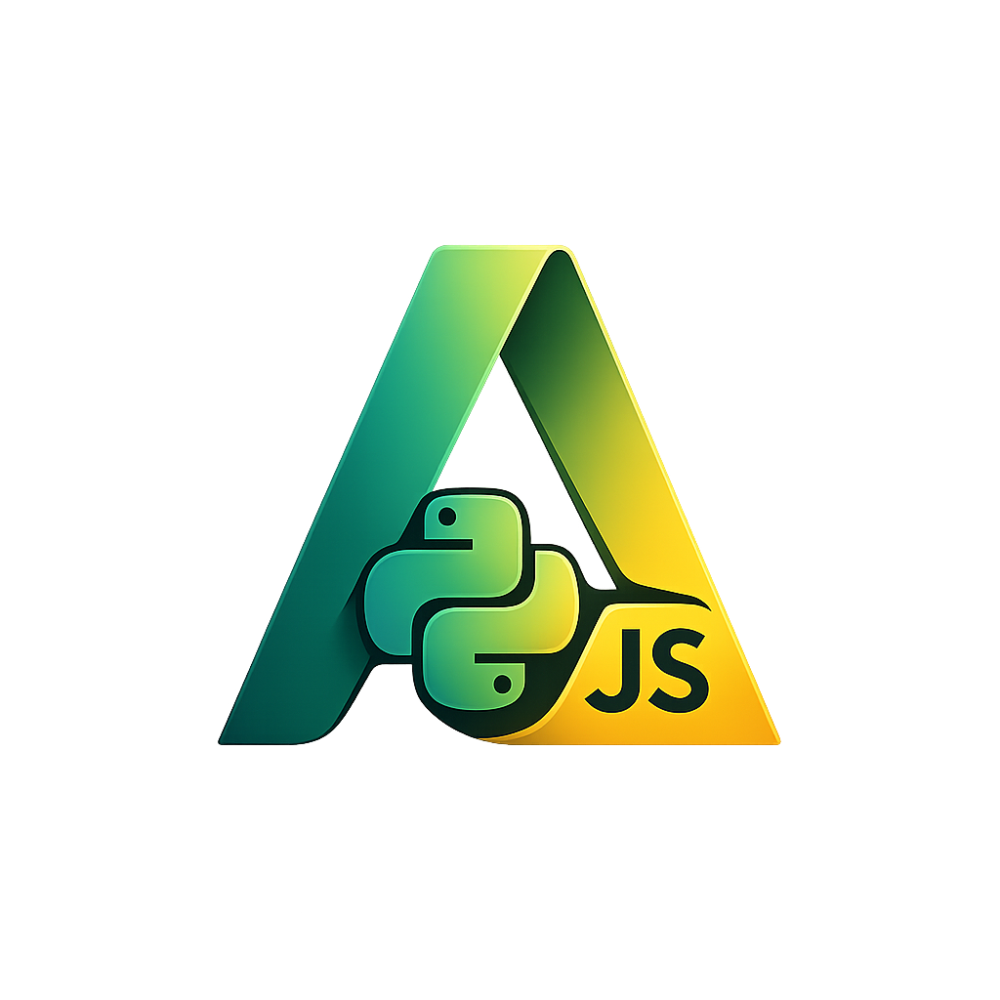
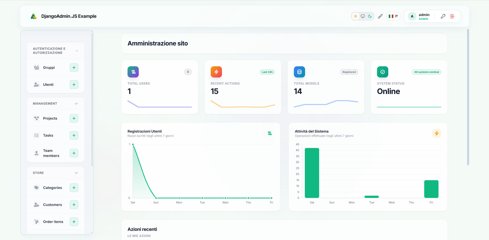

# DjangoAdmin.JS

<p align="center">
  
</p>

[](https://pypi.org/project/django-admin-js/)
[](https://opensource.org/licenses/MIT)

A modern, responsive, and gorgeous Django Admin experience built with Tailwind CSS and progressive JavaScript enhancements.

> [!WARNING]
> **DjangoAdmin.JS is currently in BETA.** We are actively refining features, fixing bugs, and collecting feedback. Some API behaviors or style configurations might change before the official v1.0.0 release. Contributions and bug reports are highly welcome!

Features a beautifully redesigned UI, customizable graphic styles (glassmorphism/minimalist), seamless AJAX page loads (no full page reloads), asynchronous form actions, and a Spotlight-like interactive Command Palette.

👉 **[Launch the Live Interactive Demo Page](https://rococo034.github.io/DjangoAdmin.JS/)** to experience it directly in your browser!



---

## ✨ Features & Capabilities

- 🎨 **Tailwind CSS Driven & Modern UI**: Sleek premium aesthetics with responsive layouts for mobile, tablet, and desktop viewports.
- 🌗 **Dark Mode Support**: Built-in support for dark themes with instant toggles and settings syncing.
- ⚡ **Seamless AJAX Navigation (PJAX)**: Instant search, pagination, and sorting filtering without page reloads.
- 📩 **Asynchronous Forms & Actions**: Non-blocking form submissions and delete actions, with inline validation error styling and success toast notifications.
- ⚙️ **Unified Configuration Settings**: Easily configure global settings, default layout styles, and colors in `settings.py`.
- 🎭 **Dynamic Layout Presets**:
  - `default`: Clean rounded cards with soft shadows.
  - `glassmorphism`: Frosty translucent glass panels with real-time backdrop blur.
  - `minimalist`: High-contrast, borders-first layout with focused input outlines.
- 🔍 **Raycast/Spotlight Command Palette (`Ctrl+K` / `Cmd+K`)**: Live search bar with instant actions, styled command triggers (e.g. `/style glassmorphism`, `/color emerald`, `/mode dark`), and quick view routes.

---

## 🚀 Quick Start

### 1. Installation

Install via pip from [PyPI](https://pypi.org/project/django-admin-js/):

```bash
pip install django-admin-js
```

### 2. Configuration

Add `django_admin_js` to your `INSTALLED_APPS` **before** `django.contrib.admin`:

```python
INSTALLED_APPS = [
    "django_admin_js",  # Must be before admin
    "django.contrib.admin",
    "django.contrib.auth",
    "django.contrib.contenttypes",
    "django.contrib.sessions",
    "django.contrib.messages",
    "django.contrib.staticfiles",
    # ... your apps
]
```

### 3. Customization Options (Optional)

You can customize behaviors, visual styles, and color themes of DjangoAdmin.JS by adding the `DJANGO_ADMIN_JS` settings dictionary in your `settings.py`:

```python
DJANGO_ADMIN_JS = {
    # Enable/Disable Live Search (As-You-Type instant filtering in list views)
    "LIVE_SEARCH": True,

    # Minimum characters required to trigger live search (defaults to 3)
    "LIVE_SEARCH_MIN_CHARS": 3,

    # Debounce delay in milliseconds before triggering search (defaults to 300)
    "LIVE_SEARCH_DEBOUNCE_MS": 300,

    # Enable/Disable the Header Theme & Layout Switcher popover widget
    "THEME_PICKER": True,

    # Enable/Disable the Header Language Switcher widget (defaults to False)
    # Note: Requires i18n URL patterns path("i18n/", include("django.conf.urls.i18n")) to be defined in urls.py
    "LANGUAGE_SWITCHER": True,

    # List of languages available in the switcher (defaults to settings.LANGUAGES)
    # Each language is a tuple: (code, name, optional_icon_class_or_emoji)
    # Supports FontAwesome classes (e.g. "fa-solid fa-globe") and flag-icons (e.g. "fi fi-it")
    "LANGUAGES": [
        ("it", "Italiano", "fi fi-it"),
        ("en", "English", "fi fi-gb"),
        ("es", "Español", "fi fi-es"),
    ],

    # Initial color theme preset (defaults to "indigo" if not specified)
    # Built-in presets: "indigo", "emerald", "amber", "rose", "violet", "ocean"
    "DEFAULT_THEME": "indigo",

    # Initial graphic layout style 
    # Options: "default", "glassmorphism", "minimalist"
    "THEME_STYLE": "default",

    # Enable/Disable Collapsible Sidebar sections for each application (defaults to True)
    "SIDEBAR_COLLAPSIBLE": True,

    # Initial collapse state of sidebar app sections (defaults to False)
    "SIDEBAR_COLLAPSED_DEFAULT": False,

    # Custom text for the admin header branding (defaults to Django administration)
    "SITE_HEADER": "My Custom Admin",

    # Custom URL or path for the admin header and login logo
    "SITE_LOGO": "/static/my_app/logo.png",

    # Custom links to show in the sidebar.
    # If the key matches an existing app label (e.g. "auth"), links are appended to that app.
    # Otherwise, a brand new app section is created in the sidebar.
    "CUSTOM_LINKS": {
        "store": [
            {
                "name": "Custom Report",
                "url": "/admin/custom-report/",
                "icon": "fa-solid fa-chart-line",
            }
        ],
        "external_tools": [
            {
                "name": "Google",
                "url": "https://google.com",
                "icon": "fa-brands fa-google",
            }
        ]
    },

    # Map models/apps to icons.
    # Supports FontAwesome classes (FontAwesome 6.4.0 is bundled),
    # Heroicon keywords ("user", "users", "group", "site", "cog", "database", "key", "shield", "tag", "folder"),
    # or direct custom raw HTML/SVG.
    "MODEL_ICONS": {
        "auth.user": "fa-solid fa-user-shield",
        "auth.group": "fa-solid fa-users-gear",
        "management.teammember": "fa-solid fa-user-tie",
        "management.project": "fa-solid fa-diagram-project",
        "store.product": "fa-solid fa-box-open",
        # Case-insensitive, supports either <app_label>.<model_name> or just <model_name>
    },

    # Custom Model Actions (rendered as buttons on the opposite side of default list actions)
    "CUSTOM_MODEL_ACTIONS": {
        "store.order": [
            {
                "name": "Export Report",
                "url": "/admin/store/order/export/",
                "icon": "fa-solid fa-file-export",
                "class": "bg-indigo-600 hover:bg-indigo-700 text-white border-transparent", # Optional CSS classes
                "target": "_blank", # Optional target attribute
            }
        ]
    }
}
```

## 💻 Client-side JavaScript API

DjangoAdmin.JS exposes a global utility helper class `DjangoAdminJS` on the `window` object to allow developer interaction within custom views or Django admin pages:

### Show Alerts (Toasts)

You can programmatically trigger a toast notification from your JavaScript code:

```javascript
// Show a warning alert
DjangoAdminJS.showAlert("Attenzione, operazione non consentita!", DjangoAdminJS.ALERT_SEVERITY.WARN);
```

#### API Signature
```javascript
DjangoAdminJS.showAlert(message, severity, duration = 5000);
```

#### Available Severities (`DjangoAdminJS.ALERT_SEVERITY`)
* `DjangoAdminJS.ALERT_SEVERITY.INFO` (Default)
* `DjangoAdminJS.ALERT_SEVERITY.SUCCESS`
* `DjangoAdminJS.ALERT_SEVERITY.WARN`
* `DjangoAdminJS.ALERT_SEVERITY.ERROR`

---

## 📊 Compatibility

- **Django**: 5.0, 5.1, 5.2+
- **Python**: 3.10, 3.11, 3.12+

---

## 🛠 Local Development & Demo

To test and develop `django-admin-js` locally, you can use the self-contained `example` project. It comes pre-configured with `django-browser-reload` to automatically refresh your browser whenever you modify the templates or static files in `django_admin_js`.

### 1. Set up the environment
Create a virtual environment and install the package in editable mode along with development requirements:
```bash
python3 -m venv .venv
source .venv/bin/activate
pip install -e . django-browser-reload
```

### 2. Run the Demo Project
Navigate to the `example` directory, apply migrations, and start the development server:
```bash
cd example
python manage.py migrate
python manage.py runserver
```

### 3. Log In to Admin
Open [http://127.0.0.1:8000/admin/](http://127.0.0.1:8000/admin/) in your browser and log in with the pre-created admin user:
- **Username**: `admin`
- **Password**: `admin`

---

## 🤝 Contributing

Contributions are welcome! Please see [CONTRIBUTING.md](CONTRIBUTING.md) for details.

---

## 📄 License

This project is licensed under the MIT License - see the [LICENSE](LICENSE) file for details.
